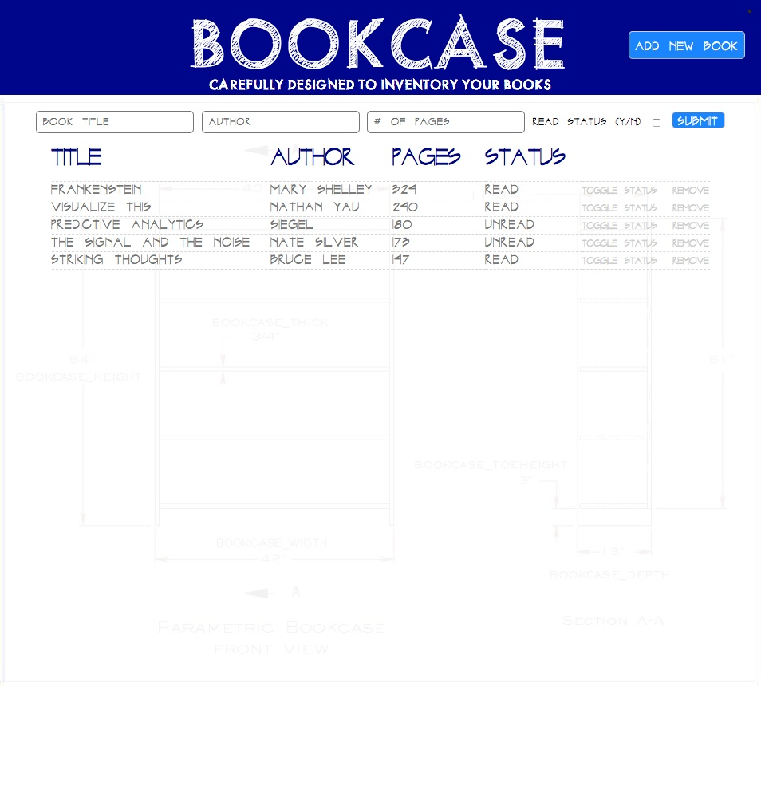

# Bookcase

### Project completed as part of The Odin Project course work

1. Create application to display library of books
2. Include New Book button to add books, toggle to update read status and Remove button to delete books
3. Hook up to Firebase to save data on server in the cloud
